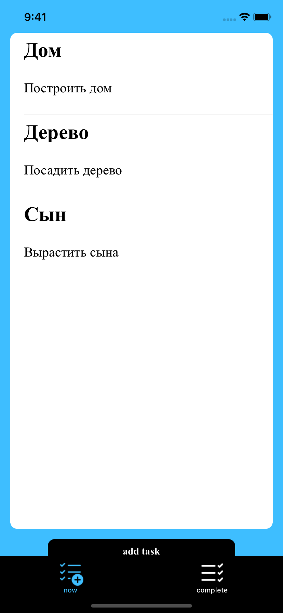
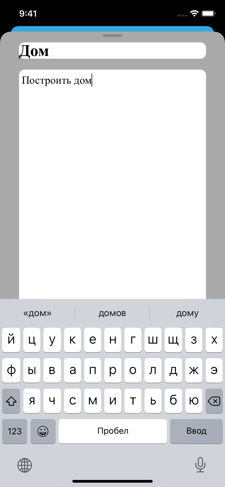
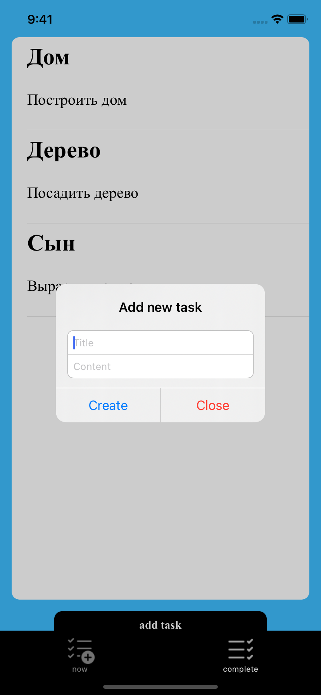
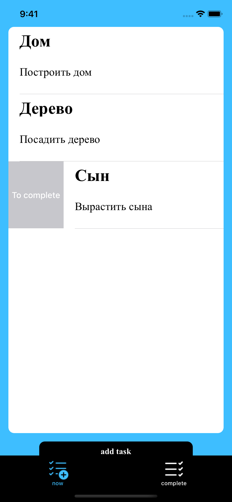
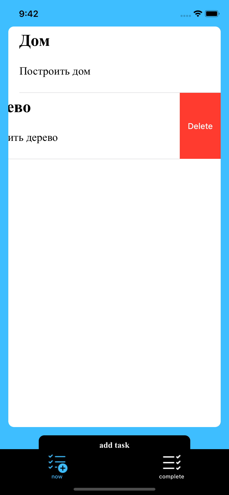

## Описание приложения

Приложение - менеджер задач.

Стартовый экран - таббар с двумя экранами.

Первый (актуальные задачи) - таблица со списком актуальных задач.

Второй (выполненные задачи) - таблица со списком выполненных задач.

При нажатии на ячейку открывается экран редактирования задачи, содержащий:
- название
- содержание

При нажатии на кнопку "добавить задачу" появляется алерт.

При свайпе влево или вправо на задаче можно либо перенести задачу с одного экрана на другой, либо удалить.

    

## Установка библиотек

В приложении используется библиотека Realm (база данных), для установки необходимо использовать команду pod install.
